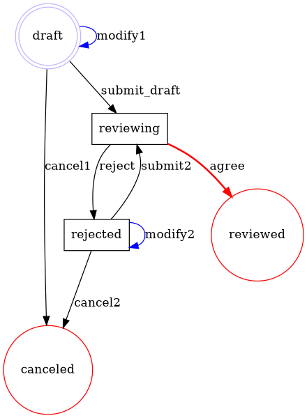

# Flexflow

[](https://github.com/clszzyh/flexflow/actions)
[](http://hex.pm/packages/flexflow)
[](http://hex.pm/packages/flexflow)
[](https://hexdocs.pm/flexflow/readme.html)
[](https://github.com/clszzyh/flexflow/commits/master)

<!-- MDOC -->

## Usage

```elixir
defmodule Review do
  use Flexflow.Process, version: 1

  defmodule Reviewing do
    use Flexflow.Event
  end

  defmodule Submit do
    use Flexflow.Transition
  end

  ## Start event
  event {Start, "draft"}
  ## End event
  event {End, "reviewed"}
  event {End, "canceled"}
  ## Intermediate event
  event "rejected"
  ## Custom event
  event Reviewing

  ## Define a transition
  ## `a ~> b` is a shortcut of `{a, b}`
  transition "modify1", "draft" ~> "draft"
  transition "cancel1", "draft" ~> "canceled"

  ## Custom transition
  transition Submit, "draft" ~> Reviewing

  transition "modify2", "rejected" ~> "rejected"
  transition "cancel2", "rejected" ~> "canceled"

  ## With custom name
  transition {Submit, "submit2"}, "rejected" ~> Reviewing

  transition "reject", Reviewing ~> "rejected"
  ## `async` mode means this transition run's in a separated elixir process.
  transition "agree", Reviewing ~> "reviewed", async: true
end
```

<!-- MDOC -->

## Graphviz Dot

<details>
<summary></summary>


</details>

## See Also

* [BPMN document](https://www.omg.org/spec/BPMN/2.0/PDF)
* [Activiti document](http://www.mossle.com/docs/activiti/index.html#bpmn20)
