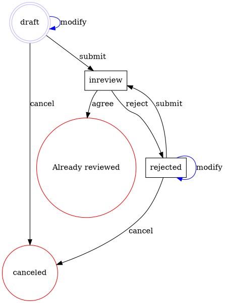

# Flexflow

[](https://github.com/clszzyh/flexflow/actions)
[](http://hex.pm/packages/flexflow)
[](http://hex.pm/packages/flexflow)
[](https://hexdocs.pm/flexflow/readme.html)
[](https://github.com/clszzyh/flexflow/commits/master)

<!-- MDOC -->

## Usage

```elixir
defmodule Review do
  @moduledoc false

  defmodule Draft do
    use Flexflow.Node
  end

  defmodule Inreview do
    use Flexflow.Node
  end

  defmodule Reviewed do
    use Flexflow.Node
  end

  defmodule Rejected do
    use Flexflow.Node
  end

  defmodule Canceled do
    use Flexflow.Node
  end

  defmodule Submit do
    use Flexflow.Transition
  end

  defmodule Agree do
    use Flexflow.Transition
  end

  defmodule Modify do
    use Flexflow.Transition
  end

  defmodule Reject do
    use Flexflow.Transition
  end

  defmodule Cancel do
    use Flexflow.Transition
  end

  use Flexflow.Process, version: 1

  ## Define a start node
  start_node Draft
  ## Define an end node
  end_node Canceled
  end_node {Reviewed, "Already reviewed"}
  ## Define an intermediate node
  intermediate_node Inreview
  intermediate_node Rejected

  ## Define a transition
  ## `a ~> b` is a shortcut of `{a, b}`
  transition Submit, Draft ~> Inreview
  transition Modify, Draft ~> Draft
  transition Cancel, Draft ~> Canceled

  transition Submit, Rejected ~> Inreview
  transition Modify, Rejected ~> Rejected
  transition Cancel, Rejected ~> Canceled

  ## Define a transition
  transition Reject, Inreview ~> Rejected
  transition Agree, Inreview ~> {Reviewed, "Already reviewed"}
end
```

<!-- MDOC -->

## Graphviz Dot

<details>
<summary></summary>


</details>


## See Also

* [BPMN document](https://www.omg.org/spec/BPMN/2.0/PDF)
* [Activiti document](http://www.mossle.com/docs/activiti/index.html#bpmn20)
