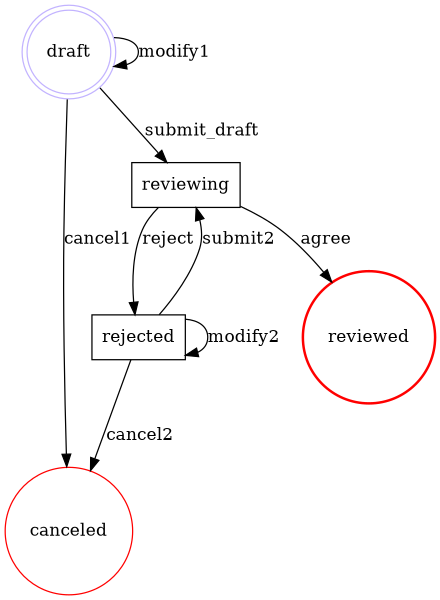

# Flexflow

[](https://github.com/clszzyh/flexflow/actions)
[](http://hex.pm/packages/flexflow)
[](http://hex.pm/packages/flexflow)
[](https://hexdocs.pm/flexflow/readme.html)
[](https://github.com/clszzyh/flexflow/commits/master)


<!-- MDOC -->

## Usage

```elixir
defmodule Review do
  @vsn "1.0.1"
  use Flexflow.Process

  defmodule Reviewing do
    use Flexflow.State
  end

  defmodule Submit do
    use Flexflow.Event
  end

  ## Start state
  state {Start, :draft}
  state {End, :reviewed}
  state {End, :canceled}
  ## Bypass state
  state :rejected
  ## Custom state
  state Reviewing

  ## Define a event
  ## `a ~> b` is a shortcut of `{a, b}`
  event :modify1, :draft ~> :draft
  event :cancel1, :draft ~> :canceled

  ## Custom event
  event Submit, :draft ~> Reviewing

  event :modify2, :rejected ~> :rejected
  event :cancel2, :rejected ~> :canceled

  ## With custom name
  event {Submit, :submit2}, :rejected ~> Reviewing

  event :reject, Reviewing ~> :rejected
  event :agree, Reviewing ~> :reviewed
end
```

<!-- MDOC -->

## Graphviz Dot

<details>
<summary></summary>


</details>


## TODO

1. Support `:gen_statem`

```
State(S) x Event(E) -> Actions(A), State(S')
```

## See also

* https://erlang.org/doc/design_principles/statem.html
* https://en.wikipedia.org/wiki/Business_Process_Model_and_Notation
