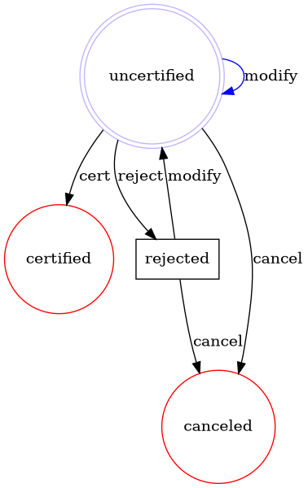

# Flexflow

[](https://github.com/clszzyh/flexflow/actions)
[](http://hex.pm/packages/flexflow)
[](http://hex.pm/packages/flexflow)
[](https://hexdocs.pm/flexflow/readme.html)
[](https://github.com/clszzyh/flexflow/commits/master)

<!-- MDOC -->

## Usage

```elixir
defmodule Verify do
  @moduledoc false

  defmodule Uncertified do
    use Flexflow.Node
  end

  defmodule Certified do
    use Flexflow.Node
  end

  defmodule Rejected do
    use Flexflow.Node
  end

  defmodule Canceled do
    use Flexflow.Node
  end

  defmodule Cert do
    use Flexflow.Transition
    @impl true
    def handle_enter(_, _, _), do: :pass
  end

  defmodule Modify do
    use Flexflow.Transition
    @impl true
    def handle_enter(_, _, _), do: :pass
  end

  defmodule Reject do
    use Flexflow.Transition
    @impl true
    def handle_enter(_, _, _), do: :pass
  end

  defmodule Cancel do
    use Flexflow.Transition
    @impl true
    def handle_enter(_, _, _), do: :pass
  end

  use Flexflow.Process, version: 1

  start_node Uncertified
  end_node Certified
  intermediate_node Rejected
  end_node Canceled

  transition Cert, Uncertified ~> Certified
  transition Modify, Uncertified ~> Uncertified
  transition Reject, Uncertified ~> Rejected
  transition Cancel, Uncertified ~> Canceled
  transition Modify, Rejected ~> Uncertified
  transition Cancel, Rejected ~> Canceled
end
```

<!-- MDOC -->

## Dot

<details>
<summary></summary>


</details>


## See Also

* [BPMN document](https://www.omg.org/spec/BPMN/2.0/PDF)
* [Activiti document](http://www.mossle.com/docs/activiti/index.html#bpmn20)
